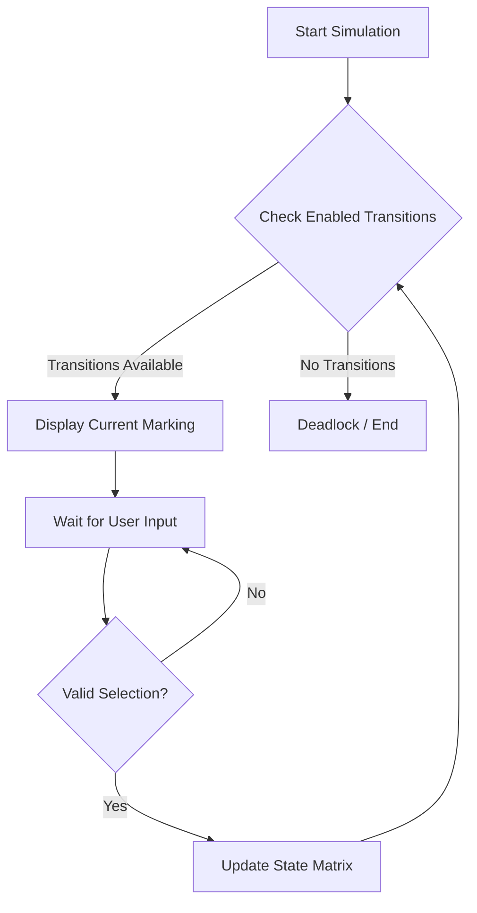

# Matrix Petri Net Simulator


A lightweight, matrix-based implementation of Petri Nets in Python. This project simulates the behavior of concurrent systems using the formal mathematical definition of Petri Nets, leveraging NumPy for efficient state transitions and vector operations.

## 🏗 Architecture

The simulator operates on a continuous loop of checking the system state, identifying enabled transitions, and processing user input to fire transitions.



## 🚀 Features

- **Matrix Representation**: Uses Pre-incidence and Post-incidence matrices to define network topology.
- **Interactive CLI**: Step-by-step simulation controlled by the user.
- **Deadlock Detection**: Automatically detects when no further transitions can fire.
- **Efficient Calculation**: Utilizes NumPy for fast vector arithmetic to determine state changes.

## 🛠 Installation

1. Clone the repository:
   ```bash
   git clone https://github.com/yourusername/petri-net.git
   cd petri-net
   ```

2. Install the required dependencies:
   ```bash
   pip install numpy
   ```

## 💻 Usage

Run the simulator script directly from the terminal:

```bash
python petri-net.py
```

Follow the on-screen prompts to select which transition to fire. Type `exit` to quit the simulation.

## 🤝 Contributing

Contributions are welcome! Please feel free to submit a Pull Request.

1. Fork the project
2. Create your feature branch (`git checkout -b feature/AmazingFeature`)
3. Commit your changes (`git commit -m 'Add some AmazingFeature'`)
4. Push to the branch (`git push origin feature/AmazingFeature`)
5. Open a Pull Request

## 📄 License

This project is licensed under the [Unlicense](LICENSE) - see the LICENSE file for details.
